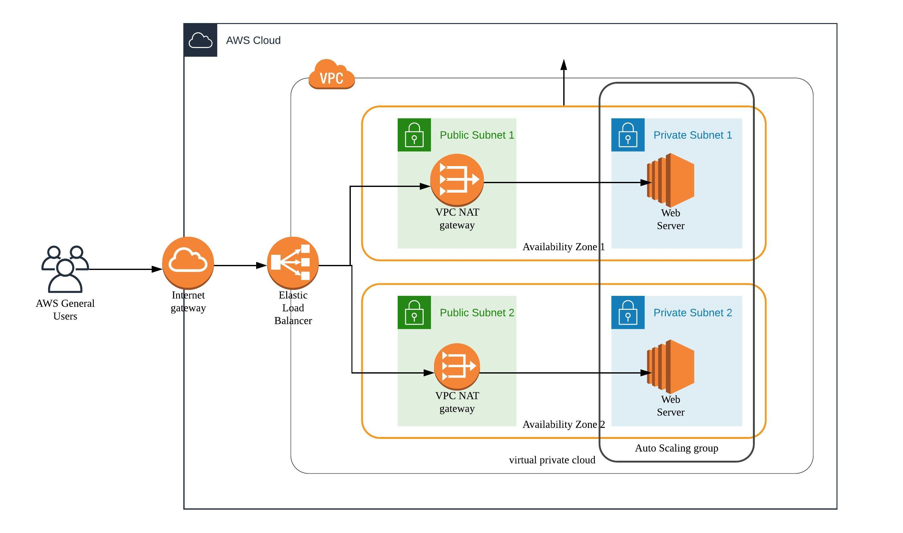

### Project 2 - Deploy a High-Availability Web App using CloudFormation

#### Architecture Diagram



#### Deployment

1. Save Parameters into SSM

```sh
chmod +x init-ssm.sh
./init-ssm.sh UdacityProject2
```

2. Create network stack

```sh
chmod +x create-stack.sh

./create-stack.sh udacity-project-2-network-stack network.yml
```

Verify the `udacity-project-2-network-stack` is successfully created.

3. Create servers stack

Make sure `create-stack.sh` has below line of code

```sh
# other code
--capabilities CAPABILITY_NAMED_IAM
```

```sh
./create-stack.sh udacity-project-2-servers-stack servers.yml
```

Verify the `udacity-project-2-servers-stack` is successfully created.

Check the "Outputs" tab of CloudFormation management console, and verify the `WebAppLoadBalancerDNSName` Outputs is there.
